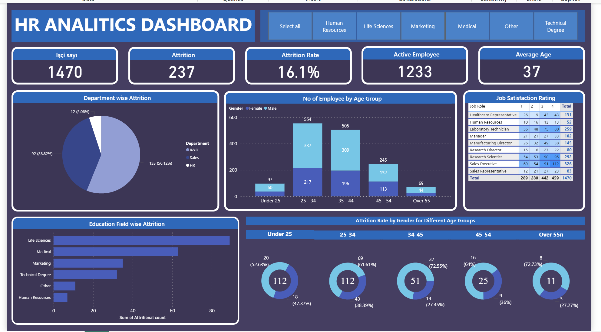
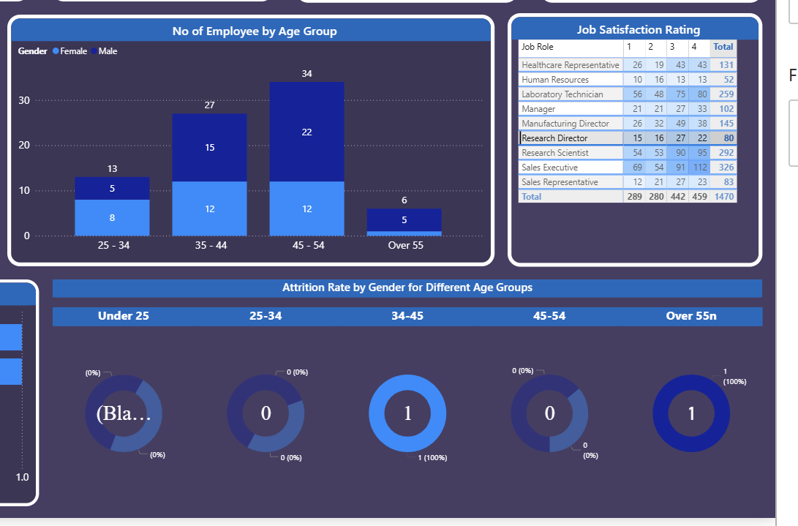
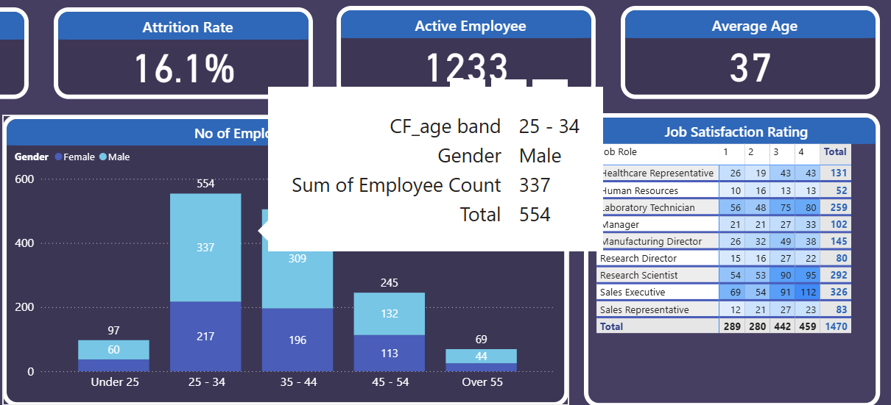
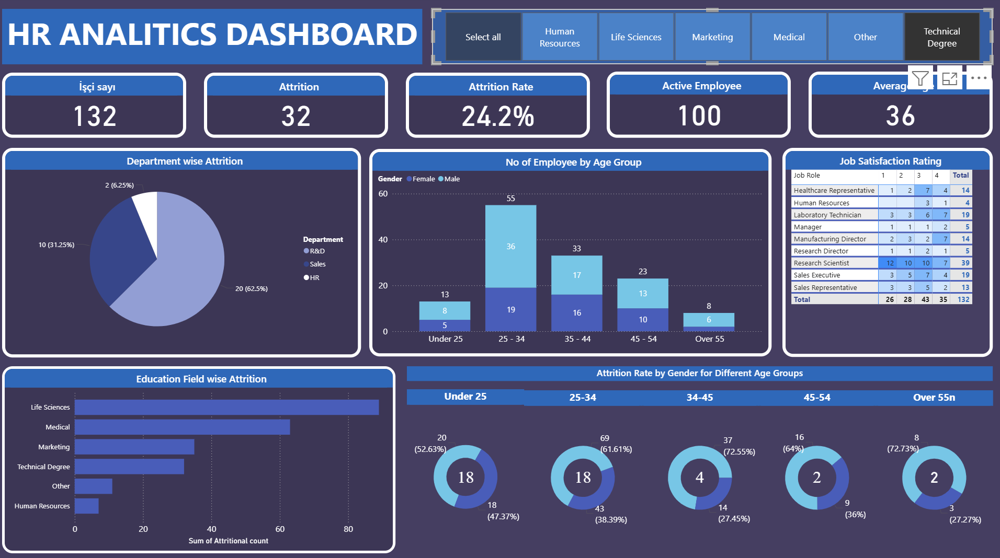

# 📊 HR Analytics Dashboard (Power BI)

## 📌 Project Overview  
This project analyzes **HR data** to uncover insights about employee attrition, workforce demographics, education fields, and job satisfaction.  
The dashboard is designed as a **decision-support tool for HR teams**, combining both data cleaning and visualization.  

---

## 🗂 Dataset  
- **Source:** `HR Data.xlsx`  
- **Records:** 1470 employees  
- **Key Columns:**  
  - Age, Gender, Marital Status  
  - Department, Education Field  
  - Job Role, Job Satisfaction  
  - Attrition (Yes/No)  
  - Monthly Income, Years at Company  

👉 The raw dataset is included in the repository for reproducibility.  

---

## 🧹 Data Preparation (Power Query)  
- **Age Groups** → Custom column created (Under 25, 25–34, 35–44, 45–54, 55+).  
- **Attrition** → Converted to Yes/No, attrition rate calculated.  
- **Department & Education Field** → Grouped to analyze turnover distribution.  
- **Job Satisfaction** → Pivoted by job role, satisfaction levels aggregated.  
- **Gender Distribution** → Segmented by male/female across age groups.  

---

## 📊 Key Insights  
1️⃣ **Total Employees:** 1470 (1233 active)  
2️⃣ **Attrition Rate:** 16.1% → highest in **R&D (56%)** and **Sales (39%)**  
3️⃣ **Average Age:** 37 → largest group is **25–34 years old**  
4️⃣ **Education Field:** Attrition is most common in **Life Sciences** and **Medical**  
5️⃣ **Job Satisfaction:** Lab Technicians and Sales Executives show the widest variation  
6️⃣ **Gender Distribution:** Males dominate in the 25–34 group  

---

## 📸 Dashboard Screenshots  

- **Overview**  
    

- **Age & Gender Distribution + Job Satisfaction**  
    

- **Attrition Rate by Age Group (Detail Example: 25–34 Male)**  
    

- **Filtered Dashboard (Technical Degree Employees)**  
    

---

## 🛠 Tools Used  
- **Power BI** → Data modeling & visualization  
- **Power Query** → Data cleaning & transformation  
- **Excel** → Raw dataset  

---

## 👩‍💻 About Me

I'm **Gulsara Mirzayeva**, an aspiring **Data Scientist** with a strong focus on data analytics, statistics, and visualization.  
Through hands-on projects like this one, I aim to deepen my skills in data interpretation, statistical modeling, and visual storytelling using Python and Power BI.  

This project is part of my continuous journey to build a professional portfolio that reflects both my analytical thinking and practical problem-solving abilities.  

📫 [LinkedIn Profile](https://www.linkedin.com/in/gulsara-mirzayeva-298a3b359/)  
📧 Email: mirzayevagulsare@gmail.com

---

## 📌 Tags  
#PowerBI #HRAnalytics #DataAnalytics #Dashboard #BusinessIntelligence #DataVisualization #GitHub #Portfolio  
